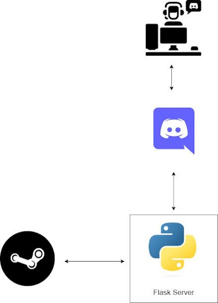

# SteamScrapeBot

SteamScrapeBot is a tool designed to scrape data from Steam. This bot can be used for various purposes, including gathering information about games, prices, reviews, and more.

## Features

- Scrape game details including name, price, and reviews.
- Gather data on game sales and discounts.
- Extract user reviews and ratings.

## Principal Schema



## Installation

1. Clone the repository:
   ```bash
   git clone https://github.com/Collaborative-Software-Development-Club/SteamScrapeBot.git
   ```
2. Navigate to the project directory:
   ```bash
   cd SteamScrapeBot
   ```
3. Install the required dependencies:
   ```bash
   pip install -r requirements.txt
   ```

## Usage

Run the bot:

```bash
python steammethods.py
```

## Contributing

Contributions are welcome! Please fork the repository and create a pull request.

## License

This project is licensed under the MIT License.
